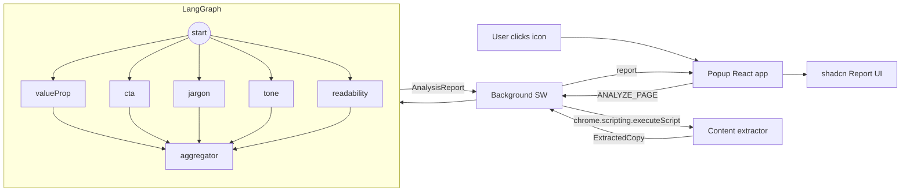

# Strada — Design Notes

## High-Level Architecture



## Key Architectural Decisions

### LangGraph fan-out / fan-in

Each of the five analysis nodes (valueProp, cta, jargon, tone, readability) is wired from `START` to `aggregator` via `END`. LangGraph runs them concurrently because they share no data dependencies — they all read from `state.extracted` and write to independent state channels. This keeps total latency close to the slowest single node rather than the sum of all five.

The alternative — a sequential chain — would be simpler but 4-5× slower for the user. Given Gemini's ~2s per call, parallel execution matters.

### Readability: hybrid local + LLM

Flesch-Kincaid grade and reading ease are computed locally on `bodyText` before the LLM call. The computed score is passed to the LLM as an anchor, and the LLM's returned `categoryScore` is clamped to ±10 of the local metric. This prevents the LLM from hallucinating an arbitrary score while still allowing qualitative adjustment for things the formula misses (e.g. jargon-dense text that happens to have short sentences).

### Content extractor is self-contained

`src/content/extractor.ts` imports nothing from `@/lib/`. `chrome.scripting.executeScript({ func })` serializes the function to a string and re-evaluates it in the page context — any closure over imports would break at runtime. The extractor defines its own narrow return type inline.

### Typed discriminated unions for messages

`BgMessage` and `BgResponse` in `types.ts` are shared between popup and service worker. This gives compile-time exhaustiveness checking on both ends — adding a new message type forces handling it everywhere via TypeScript's discriminated union narrowing.

### Zod schemas at runtime boundaries

Raw data crosses two trust boundaries: the DOM (extractor output) and the LLM (node results). Both are validated with Zod `safeParse`. Validation failures map to typed error codes rather than runtime crashes.

### API key baked at build time

`VITE_GEMINI_API_KEY` is inlined by Vite at build time via `import.meta.env`. This means no key management UI is needed, but the key is visible in the built JS bundle. Acceptable for a personal tool; not acceptable for distribution (see production concerns below).

### shadcn/ui only — no custom CSS

All component styling uses Tailwind utilities and shadcn's CSS variable theme. This keeps the popup's appearance consistent with the system theme and avoids specificity wars between custom CSS and utility classes.

## Run Instructions

```bash
pnpm install
cp .env.example .env.local
# Set VITE_GEMINI_API_KEY in .env.local
pnpm build
# Load dist/ via chrome://extensions → Developer mode → Load unpacked
```

For development with HMR:
```bash
pnpm dev
# Load dist/ once; CRXJS reloads on save
```

## Production Concerns

**API key exposure** — The Gemini key is embedded in the built JS bundle. For a public extension, proxy all LLM calls through a backend you control. The proxy authenticates the extension (e.g. Chrome Identity API) and holds the key server-side.

**PII / privacy** — The extractor sends page body text to Google's Gemini API. Users on pages with sensitive content (medical portals, banking dashboards) may not expect this. A production extension should clearly disclose what data leaves the browser and offer an opt-out or local-model fallback.

**Restricted origins** — `chrome://`, `chrome-extension://`, Chrome Web Store, and `file://` URLs are blocked at the SW level. However, iframes, shadow DOM content, and pages that lazy-load copy via JS after DOMContentLoaded will be partially or fully missed by the extractor.

**SPA / lazy content** — The extractor runs at `executeScript` time; content loaded after scroll or user interaction is invisible. A production version would need a MutationObserver or a "re-analyze" button that the user triggers after the page fully loads.

**Large pages** — `bodyText` is truncated to 8000 chars. Pages with extensive copy (long-form articles, documentation) will have their tail silently dropped. Chunking + map-reduce over multiple LLM calls would give complete coverage.

**LLM retries and partial results** — Each node wraps `chain.invoke` in
`withRetry` (3 attempts, exponential 400→800 ms backoff). If all attempts fail,
the node returns a fallback whose `rationale` is the `__ESTIMATED__` sentinel;
the aggregator collects those into `report.meta.estimatedCategories`, and the
popup renders an "Estimated" pill next to the affected category scores so users
know the number is a fallback, not a computed result. Hardening still to do:
classify errors (transient vs. 4xx schema failure) so we don't retry a
deterministic bad prompt, and add per-node circuit breaking.

**Caching** — Cache key is a SHA-256 over the canonical JSON of the full extracted object (url, headlines, ctas, valueProps, body). A/B test variants that change any of those fields get distinct cache entries. TTL is 10 minutes in `chrome.storage.local`; no cross-device sync, no eviction beyond TTL.

**Cost controls** — Five concurrent Gemini calls per analysis. On a page with a 30-second session, a user could trigger many analyses. Rate limiting per tab + per hour in the SW would prevent accidental runaway spend.

**i18n** — All prompts and UI strings are English-only. Non-English copy will be scored against English writing conventions, producing misleading results.

**Testing** — 37 unit + integration tests via Vitest. `text.ts` and `scoring.ts`
are covered with FK-grade benchmarks and hand-rolled weighted-score cases.
`withRetry` has exponential-backoff and exhaustion tests under fake timers. The
graph uses `FakeListChatModel` to assert fan-in: all five category scores
populated, Jaccard dedupe collapses near-duplicates, weighted aggregation rolls
up correctly. A separate end-to-end test forces every node's LLM to throw and
asserts the aggregator marks all five categories as estimated in
`report.meta.estimatedCategories`. CI runs format + lint + typecheck + test +
build on every PR. Missing: Playwright/E2E coverage of the popup UI.

## What I'd Do With Another Week

- **Proxy backend** — Move the API key server-side; add auth via Chrome Identity API.
- **Streaming progress** — Stream token output from each node so the UI shows real-time partial results rather than a spinner.
- **Diff view** — Side-by-side original vs. `improvedText` for each issue with one-click copy.
- **Per-category drill-down** — Click a category score to jump to all issues in that category with the relevant DOM element highlighted on the page.
- **MutationObserver mode** — Re-run extraction after a configurable idle delay to catch SPA-loaded content.
- **Export** — Download the full `AnalysisReport` as JSON or a formatted PDF for sharing with clients.
- **LangSmith tracing** — Wire in `LANGCHAIN_TRACING_V2` for observability on which prompts produce bad outputs.
- **E2E tests** — Playwright coverage of the popup (loading → report → error transitions) on top of the existing Vitest unit + graph tests.
- **Chunked analysis** — Split long `bodyText` into segments, run readability node on each, merge results.

## AI Tools Used

Code written with AI assistance via Cursor (Claude Opus 4.7) for Planning and Claude Code (Claude Sonnet 4.6) for Tasks 1-7. Full chat transcript: [`chat-history.txt`](./chat-history.txt).
