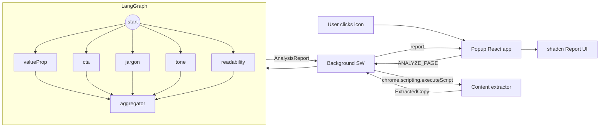

# Strada — AI Copy Analyzer

Strada is a Chrome MV3 extension that extracts copy from any webpage and runs it through a parallel LangGraph pipeline powered by Gemini 3.0 Flash Preview. It scores five dimensions of copy quality — value proposition, CTAs, jargon, tone, and readability — and surfaces actionable issues with suggested rewrites directly in the extension popup.

## Architecture



## Features

- **Parallel LLM analysis** — five specialist nodes run concurrently via LangGraph's fan-out/fan-in pattern
- **Flesch-Kincaid readability** — local metric computation fed into the LLM for grounded scoring
- **Structured output** — every LLM response validated against Zod schemas; malformed responses fail gracefully
- **10-minute cache** — repeat analyses on the same page return instantly from `chrome.storage.local`
- **Typed error codes** — `RESTRICTED`, `NO_COPY`, `LLM_ERROR`, `MISSING_KEY` surfaced in the popup UI
- **shadcn/ui only** — no custom component CSS; Tailwind utilities + Radix primitives throughout

## Screenshots


## Prerequisites

- Node ≥ 20
- pnpm
- A [Google AI Studio](https://aistudio.google.com/app/apikey) API key with Gemini access

## Setup

```bash
pnpm install
cp .env.example .env.local
# edit .env.local — set VITE_GEMINI_API_KEY=your_key_here
pnpm build
```

Then in Chrome:

1. Navigate to `chrome://extensions`
2. Enable **Developer mode**
3. Click **Load unpacked** → select the `dist/` folder

## Dev (HMR)

```bash
pnpm dev
```

CRXJS serves the extension with hot module replacement. Load `dist/` once; subsequent saves reload automatically.

## Scripts

| Script           | What it does                                  |
| ---------------- | --------------------------------------------- |
| `pnpm dev`       | Start Vite dev server with CRXJS HMR          |
| `pnpm build`     | TypeScript check + production build → `dist/` |
| `pnpm typecheck` | `tsc --noEmit` only                           |
| `pnpm test`      | Run unit tests with Vitest                    |
| `pnpm lint`      | ESLint on `src` (zero warnings allowed)       |
| `pnpm format`    | Prettier write on `src`                       |

## Design Decisions

Three decisions worth calling out — full rationale (trade-offs, alternatives, production concerns) lives in [`NOTES.md`](./NOTES.md):

- **Parallel LangGraph over a sequential chain.** The five analysis nodes share no data dependencies, so they fan out from `START` and fan in at the aggregator. Total latency tracks the slowest node (~2s) instead of the sum of five sequential Gemini calls. See [_LangGraph fan-out / fan-in_](./NOTES.md#langgraph-fan-out--fan-in).
- **Hybrid local + LLM readability scoring.** Flesch-Kincaid is computed deterministically in the browser, then passed to the LLM as an anchor and clamped to ±10. Stops the model from hallucinating a score while still letting it flag jargon-dense-but-short-sentence copy. See [_Readability: hybrid local + LLM_](./NOTES.md#readability-hybrid-local--llm).
- **Zod schemas at every trust boundary.** DOM extraction output and every LLM node result are validated with `safeParse`. Validation failures map to typed error codes (`RESTRICTED`, `NO_COPY`, `LLM_ERROR`, `MISSING_KEY`) instead of crashing the popup. See [_Zod schemas at runtime boundaries_](./NOTES.md#zod-schemas-at-runtime-boundaries).

## AI Transparency

This project was built with AI assistance. The full, unedited chat transcript — planning, prompts, generated code, debugging — is checked in at [`chat-history.txt`](./chat-history.txt) so reviewers can audit exactly what was delegated and what was authored manually.

- **Planning:** Cursor (Claude Opus 4.7)
- **Implementation (Tasks 1–7):** Claude Code (Claude Sonnet 4.6)
